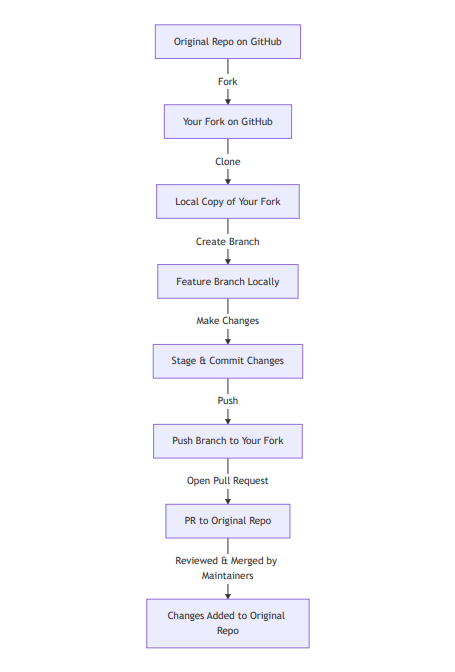

# Club IQ

<p align='center'>


</p>

## Project Description

**Club IQ** is a modern full-stack web application designed to help clubs manage activities, members, and events efficiently.

It combines:

* A **Flask REST API** backend
* A **Next.js (App Router) frontend** with Clerk authentication
* A **Docker-based containerized environment** for both backend and frontend

This project is a blueprint for building a __production-ready full-stack application__ with a clean separation between backend and frontend.

---

## Table of Contents

1. [Overview](#overview)
2. [Project Structure](#project-structure)
3. [Features](#features)
4. [Tech Stack](#tech-stack)
5. [Docker Setup](#docker-setup)
    * [Docker Guide](#additional-docker-documentation)
6. [Manual Installation](#manual-installation)
7. [API Reference](#api-reference)
    * [Authentication](#authentication)
    * [Members](#members)
8. [Testing](#testing)
9. [Contribution Guide](#how-to-contribute-to-this-project)
10. [License](#license)

---

## Overview

* The **Backend (Flask)** exposes RESTful API endpoints for authentication, user management, and (future) event handling.
* The **Frontend (Next.js + Clerk)** consumes these APIs, provides secure authentication, and delivers a clean, responsive UI for members and admins.
* The entire application is **containerized using Docker**, ensuring consistent environments across Windows, macOS, and Linux.

---

## Project Structure

```bash
ClubIQ/
│
│── Backend/                # Flask backend (API)
│   ├── app/
│   ├── requirements.txt
│   ├── entrypoint.sh
│   └── Dockerfile
│
│── Frontend/               # Next.js + Clerk frontend (UI)
│   ├── app/
│   ├── package.json
│   ├── next.config.js
│   └── Dockerfile
│
│── docker-compose.yml      # Combined setup for backend + frontend
│── README.md               # Documentation
│── .gitattributes          # Fixes entrypoint.sh on Windows
│── .gitignore
```

---

## Features

* **User Management** (register, view users, CRUD operations)
* **Clerk Authentication** (Sign up, Sign in, and Session handling)
* **Flask REST API** with modular blueprints
* **Dockerized** backend & frontend for easy setup
* **Next.js 16** for fast SSR/CSR rendering
* **Tailwind CSS v4** for styling
* **Hot reload** support in both containers
* **Axios Integration** for API calls
* **Easy configuration** for dev & prod environments
* **Cross-platform compatibility** (Windows, Linux, macOS)
<!-- - Roadmap: Event scheduling, notifications, role-based access -->

---

## Tech Stack

| Layer                    | Technology                               |
| ------------------------ | ---------------------------------------- |
| **Frontend**             | Next.js 16, Clerk, TailwindCSS |
| **Backend**              | Python 3.12, Flask, PostgreSQL           |
| **Authentication**       | Clerk (Next.js middleware integration)   |
| **Containerization**     | Docker, Docker Compose                   |
| **Deployment (Planned)** | Render / Vercel                          |
| **Future Additions**     | Reverse proxies, OS detection for builds |

---

## Docker Setup

### Prerequisites

* Docker, Docker Compose and Make installed
* `.env` files configured for Clerk and Flask API (e.g. `CLERK_PUBLISHABLE_KEY`, `DATABASE_URL`)

### Build and Run

Checkout the [**Docker.md**](./Docker.md) file for the full installation and setup as well as notes on our __Make Commands__.


### Notes for Windows users

If you get an error like:

```
/entrypoint.sh: not found
```

Make sure `.gitattributes` enforces LF endings:

```
*.sh text eol=lf
```

Then rebuild your containers:

```bash
docker compose build --no-cache <container_name>
```

---

## Manual Installation

If you prefer running without Docker:

### Backend

```bash
cd Backend
python -m venv venv
source venv/bin/activate  # Linux/Mac
venv\Scripts\activate     # Windows

pip install -r requirements.txt
flask run
```

### Frontend

```bash
cd Frontend
npm install
npm run dev
```

---

## API Reference (Flask)

### Base URL
- Development: `http://localhost:5000/api`
- Production: `https://yourdomain.com/api`

### Authentication

#### GET `/register`
Request:
```json
{
    "user_name": "tomi",
    "email": "tomi@example.com",
    "password": "mysecretpassword",
    "confirm_password": "mysecretpassword"
}
```

Response:
```json
{
    "message": "User Created successfully"
}
```

#### POST `/login`
Request:
```json
{
    "email": "tomi@example.com",
    "password": "mysecretpassword"
}


```

Response:
```json

{
    "access_token": "jwt_token_string",
    "token_type": "Bearer"
}

```

### Members
#### GET `/members`
Headers:
```makefile
Authorization: Bearer <access_token>
```

Response:
```json
[
    {"id": 1, "name": "Tom", "email": "tom@example.com"}
]
```

#### POST `/members`
Request:
```json
{
    "name": "Mary",
    "email": "mary@example.com",
    "password": "secret123"
}
```
Response:
```json
{
    "message": "Member created successfully"
}
```

## Testing

### Backend

```bash
cd Backend
pytest
```

### Frontend

```bash
cd Frontend
npm run test
```

---

## How to Contribute to This Project

#### 1. Fork the repository on GitHub.

#### 2. Clone the repository in your terminal.
```bash
    git clone https://github.com/<your-username>/<repo-name>.git
    cd <repo-name>
```

#### 3. Create a feature branch:
```bash
git checkout -b feature-name
```

#### 4. Commit your changes:
```bash
git commit -m "Added feature"
```

#### 5. Push to the branch:
```bash
git push origin feature-name
```

#### 6. Open a pull request on GitHub

---

### Visual Contribution Work flow
<p align="center">
    <!-- [Workflow](./static/images/contribution_work_flow.png) -->
    
</p>

---

### Tips for good Pull Request
- Break big changes into smaller PRs.

- Provide screenshots or examples if it’s a UI change.

- Reference issues if applicable: `Fixes #issue-number`.

- Keep your branch up to date with the main repo:

```bash
git remote add upstream https://github.com/<original-owner>/<repo-name>.git
git fetch upstream
git checkout main
git merge upstream/main
git push origin main
```

## License

Distributed under the MIT License.

### Ready to manage your club smarter? Welcome to Club IQ!
#### Happy Coding
---
